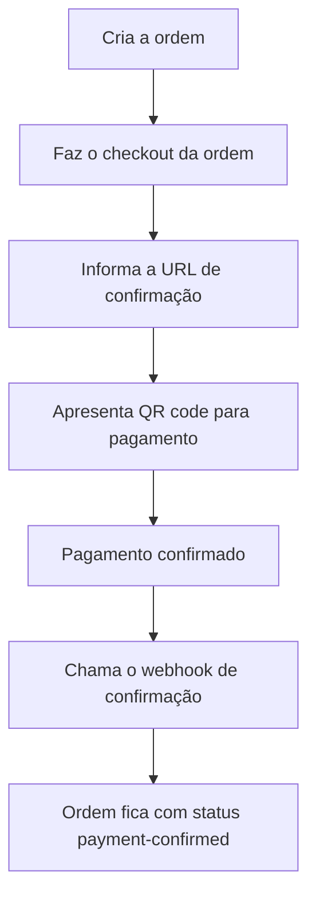

# Kitchen Control | fase 2

## Descrição

A Kitchen Control API é uma aplicação para gerenciar clientes, produtos, pedidos e itens de pedidos. Esta API fornece endpoints para criar, buscar, atualizar e deletar registros.

## Tecnologias usadas no projeto

- go 1.22.1
- GORM
- MySQL
- Gin Web Framework
- Docker
- Kind v0.25.0 (ou minikube / docker desktop)
- kubectl

## Instalação e acesso ao swagger

### Pré-requisitos

- wsl 2, macos ou linux
- go 1.22.1 ou superior
- Docker
- Git
- make
- Kind v0.25.0 (ou minikube / docker desktop)
- kubectl

### Como instalar e executar o Kitchen Control

- Para rodar no K8S, como a imagem do projeto esta no dockerhub; não é necessário gerar nova imagem.
- Os steps 1 e 2 são opcionais

1. Com o projeto baixado / clonado, instale as dependências:
    ```bash
    go mod tidy
    ```
    - se não baixar as dependências, o projeto fica indicando erro, mas, como a imagem esta no hub, vai funcionar normalmente.
    
2. Execute os testes:
    ```bash
    make test (ou go test -v -cover ./...)
    ```
    - apenas se vc quiser conhecer e ou executar os testes unitários

3. Se estiver usando kind (v0.25.0) como eu, crie o custer
    ```bash
    make setup-cluster
    ```
    - agora sim, estamos inciando a configuração do projeto em uma instalação local do K8S
    - Usei o KIND durante o desenvolvimento

4. Crie os configmaps
    ```bash
    make setup-configmap
    ```
5. Crie os deployments, services, pvc e secrets 
    ```bash
    make setup-k8s
    ```
6. Se necessário, acessar os logs
    ```bash
    make logs-k8s
    ```
7. Para desligar tudo
    ```bash
    make shutdown
    ```
    - esse comando irá deletar o cluster e os dados no DB serão perdidos 

## Como usar o Kitchen Control

### Endpoints (acesso via swagger)

8. Swagger:
    ```bash
    http://localhost:30080/kitchencontrol/api/v1/docs/index.html
    ```
    
### Client para DB - Adminer
9. Adminer
    ```bash
    http://localhost:30000/
    ```

    - usuario: root
    - senha: root
    - servidor: mysql
    - db: dbcontrol

### Gerador de CPF para os testes
10. CPFs
    ```bash
    https://www.geradordecpf.org/

### Cadastros Básicos 
- Swagger: http://localhost:30080/kitchencontrol/api/v1/docs/index.html

#### 11. Criar produtos
- É necessário criar pelo menos 1 produto para usar o sistema. 
- Os cadastros fazem parte da área administrativa
- Swagger: http://localhost:30080/kitchencontrol/api/v1/docs/index.html#/Products/post_products
```bash
curl -X 'POST' \
  'http://localhost:30080/kitchencontrol/api/v1/products' \
  -H 'accept: application/json' \
  -H 'Content-Type: application/json' \
  -d '{
  "category": "Bebidas",
  "description": "Coca Cola é um refrigerante carbonatado com sabor de baunilha, canela, óleos cítricos e outros aromatizantes",
  "name": "Coca Cola",
  "price": 13
}'
```
- obs: No swagger de produtos existem outros endpoints para administração dos produtos no sistema. Vou apresenar apenas o get all, porque é usado para criação da Order. Será necessário informar o ID do produto para criar uma ordem.

    - Swagger: http://localhost:30080/kitchencontrol/api/v1/docs/index.html#/Products/get_products
    ```bash
    curl -X 'GET' \
  'http://localhost:30080/kitchencontrol/api/v1/products' \
  -H 'accept: application/json'
    ```

#### 12. Criar um cliente
- o cliente não precisa se cadastrar, mas se ele quiser, ele pode informar o CPF apenas, mas também pode informar o email e o nome. Esses dados seriam usados para campanhas de mkt.
- No momento do cadastro, os dados (email, nome e cpf) são obrigatórios.
- Caso ele não queira fazer o cadastro, ele pode fazer o pedido (order) e pode fazer o (checkout) sem nenhum problema.
- Swagger: http://localhost:30080/kitchencontrol/api/v1/docs/index.html#/Customers/post_customers

```bash
curl -X 'POST' \
  'http://localhost:30080/kitchencontrol/api/v1/customers' \
  -H 'accept: application/json' \
  -H 'Content-Type: application/json' \
  -d '{
  "cpf": "44761877227",
  "email": "john.doe@gmail.com",
  "name": "John Doe"
}'
```
#### 13. Verificar clientes cadastrados
- É possível verificar todos os clientes cadastrados no sistema
- O dado pode ser usado em campanhas de mkt
- Swagger: http://localhost:30080/kitchencontrol/api/v1/docs/index.html#/Customers/get_customers

```bash
curl -X 'GET' \
  'http://localhost:30080/kitchencontrol/api/v1/customers' \
  -H 'accept: application/json'
```

- obs: É possível buscar clientes especificos e ou atualizar clientes especificos.
    - Swagger:http://localhost:30080/kitchencontrol/api/v1/docs/index.html
    ```bash
    curl -X 'GET' \
  'http://localhost:30080/kitchencontrol/api/v1/customers/44761877227' \
  -H 'accept: application/json'
    ```
    - Swagger: http://localhost:30080/kitchencontrol/api/v1/docs/index.html#/Customers/put_customers__cpf_
    ```bash
    curl -X 'PUT' \
  'http://localhost:30080/kitchencontrol/api/v1/customers/44761877227' \
  -H 'accept: application/json' \
  -H 'Content-Type: application/json' \
  -d '{
  "cpf": "447.618.772-27",
  "name": "John Doee",
  "email": "john.doee@gmail.com"}'
    ```
### Criar pedidos, fazer pagamentos e cozinha
- Swagger: http://localhost:30080/kitchencontrol/api/v1/docs/index.html
#### 14. Criar uma ordem
- Esse é o ponto central do sistema; o cliente quer comprar o lanche, então ele precisa fazer o pedido, para que o mesmo vá até a cozinha, e ele também vai precisar fazer o pagamento desse pedido.
- Para esse exercício, e como fiz o trabalho sozinho, optei por fazer pagamento fake, ou seja, simulando a transação entre gateways, e confirmando o pagamento usando o webhook. Vou detalhar mais no endpoint de check out.
- Nesse ponto, o cliente cria o pedido (Order), confirmando sua escolha pelo produtos indicados no pedido.
- Nesse momento, o pedido (Order) terá o status de confirmado.
- O Cliente não é obrigado a informar seu CPF ou fazer o cadastro.
- Segue um exemplo de criação de um pedido:
- Swagger: http://localhost:30080/kitchencontrol/api/v1/docs/index.html#/Orders/post_orders
```bash
curl -X 'POST' \
  'http://localhost:30080/kitchencontrol/api/v1/orders' \
  -H 'accept: application/json' \
  -H 'Content-Type: application/json' \
  -d '{
  "cpf": "",
  "items": [
    {
      "productid": "078d174f-8e40-4397-a634-26933082fa4d",
      "quantity": 2
    }
  ]
}'

```
- Veja que o CPF esta em branco (ok, isso não é um problem) e o cliente indicou apenas 1 produto, na quantidade 2. O preço do produto, nessa modelagem, foi indicado no momento do cadastro. 

```json
{
  "id": "1ba9e084-1abe-42c7-8331-72220ba9ae8a",
  "items": [
    {
      "id": "800d123f-b95e-4de6-95de-3443e6268cfc",
      "productid": "078d174f-8e40-4397-a634-26933082fa4d",
      "quantity": 2,
      "price": 15,
      "status": "item-confirmed"
    }
  ],
  "total": 30,
  "status": "order-confirmed",
  "customercpf": "",
  "created_at": "0001-01-01T00:00:00Z",
  "delivery_number": "ED105"
}
```
- Acima, temos o exemplo do json da criação do pedido. Delivery Number é o número que o cliente usa para saber que seu pedido está pronto. Foi apenas uma ideia para deixar a api mais bacana, qdo ela for (ou se fosse) usada em algum front-end.

- No próximo exemplo, o cliente informou o CPF, mas não fez o cadastro completo. Isso também não é um problema.

```bash
curl -X 'POST' \
  'http://localhost:30080/kitchencontrol/api/v1/orders' \
  -H 'accept: application/json' \
  -H 'Content-Type: application/json' \
  -d '{
  "cpf": "08345449549",
  "items": [
    {
      "productid": "078d174f-8e40-4397-a634-26933082fa4d",
      "quantity": 2
    },
    {
      "productid": "26c98e85-626d-48ce-98bc-85fea61e241b",
      "quantity": 1
    }
  ]
}'

```
```json
{
  "id": "9d4c3128-bf61-43a8-a969-38759d2a9e9c",
  "items": [
    {
      "id": "121e0349-6c6e-483c-9db0-f1186e6d3d9d",
      "productid": "078d174f-8e40-4397-a634-26933082fa4d",
      "quantity": 2,
      "price": 15,
      "status": "item-confirmed"
    },
    {
      "id": "4ffa67be-6d14-446f-8e72-7005ac033c9a",
      "productid": "26c98e85-626d-48ce-98bc-85fea61e241b",
      "quantity": 1,
      "price": 13,
      "status": "item-confirmed"
    }
  ],
  "total": 43,
  "status": "order-confirmed",
  "customercpf": "08345449549",
  "created_at": "0001-01-01T00:00:00Z",
  "delivery_number": "QT139"
}
```
- Dessa vez, o cliente pediu um lanche e uma bebida.
##### Pedidos com clientes cadastrados
- Não muda nada nos processos indicados acima, a diferença é o que cliente fez o cadastro antes de começar o pedido. Ele vai informar o CPF e fazer seu pedido tranquilamente.

##### Orderm confirmada
- Nesse momento, a ordem é considerada confirmada, e pronta para o checkout. Como se ele estivesse no sistema fazendo o pedido, e a próxima etapa seria o pagamento.

#### 15. Fazer o pagamento
obs: Nesse caso (exercício) não implementei um processo real de pagamento, usando um gateway externo, mas, tentei simular ao máximo essa integração e processo.

O processo vai ficar mais ou menos assim:

- Vamos realizar o processo passo a passo 

## Requisitos da Fase 2


## Problema para criar o banco de dados (just in case)

- Em caso de problemas com a criação do DB, será necessário remover os volumes existentes

```bash
docker-compose down -v
docker volume rm fiap-challenge-clean-arch-9soat_mysql-data
docker-compose up
```

## Acesso ao projeto no github
- Será enviado aos professores via plataforma da fiap
- https://github.com/caiojorge/fiap-challenge-clean-arch-9SOAT

## Licença
Este projeto está licenciado sob a Licença MIT - veja o arquivo [LICENSE](LICENSE) para mais detalhes.


## Makefile
- Para rodar a aplicação em local mode, use o makefile. Sem isso vc vai ter problemas com o .env file.
- Comente o app e app-payment para não carregar a imagem via docker. Deixe apenas o Mysql e o Adminer ativos no docker-compose file.
- Feito isso, execute os comandos abaixo:
```bash
make fiap-run
make run-kitchen-api
make run-payment-api
```
- Se quiser rodar "na mão", use:
```bash
 go run cmd/<app>/main.go
```

obs: app pode ser fakepaymentservice e ou kitchencontrol

